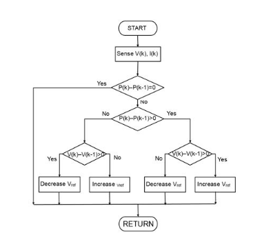
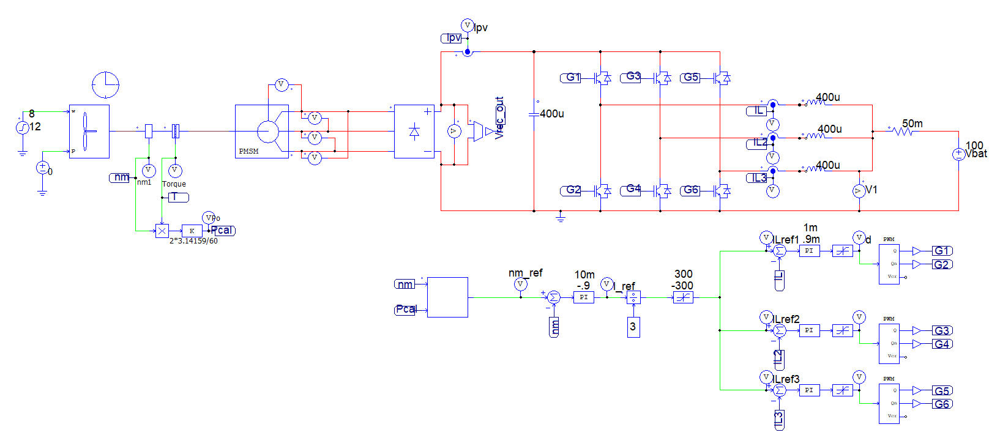
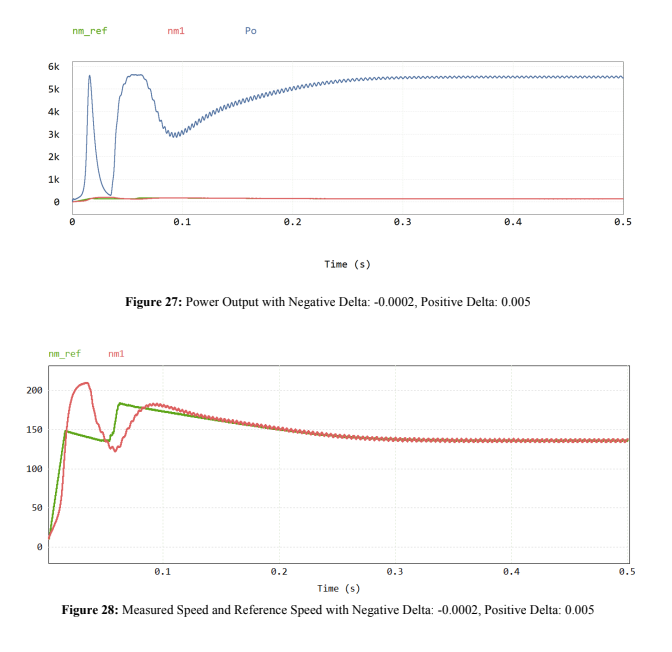
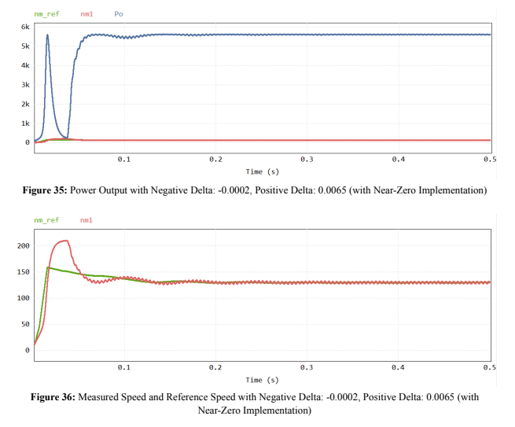

# Wind Turbine Power Generation with MPPT Tracking

This repository contains a Maximum Power Point Tracking (MPPT) algorithm implemented in PSIM for a wind turbine power generator. This project aims to optimize power extraction under different wind conditions.

[View the Full Report](Summary.pdf)

## Overview

The project simulates a wind turbine power system to analyze and control the output. The system implements a Maximum Power Point Tracking (MPPT) algorithm to constantly track and modify system parameters for maximum power extraction, regardless of the wind speed variations.

The MPPT algorithm, implemented in PSIM, allows the wind turbine system to work at its optimal power output point. This ensures that the system is not only more efficient but also maximizes the power that can be fed back into the grid.

# System Components

The project consists of the following components:

- Wind Turbine Model: This is modeled as per the standard power curve characteristics of wind turbines.
- Permanent Magnet Synchronous Generator (PMSG): This extracts the mechanical energy from the wind turbine and converts it to electrical energy.
- AC/DC and DC/DC Converters: These are used for power conversion and controlling the speed of the PMSG.
- MPPT Algorithm: This optimizes the duty cycle of the converter for maximum power extraction.

#  Schematics

# MPPT Simulation Results

# MPPT Simulation Results (with NearZero Implementation)

The "NearZero" Implementation is an edit to the logic flow chart (shown in C block code) in which we consider changes in power close enough to zero as zero. The optimzal threshold was 0.02, resulting in a change of less than 0.02 considered as 0. This was done to minimize pulsing at peak power and allow our system to reach peak power quicker and more stable.

# Getting Started
To use this PSIM model, follow these steps:

- Download and install PSIM.
- Clone this repository to your local machine using https://github.com/<YourGithubUsername>/Wind-Turbine-MPPT.git
- Open the .psimsch file in PSIM.

# Contributing

Pull requests are welcome. For major changes, please open an issue first to discuss what you would like to change.
